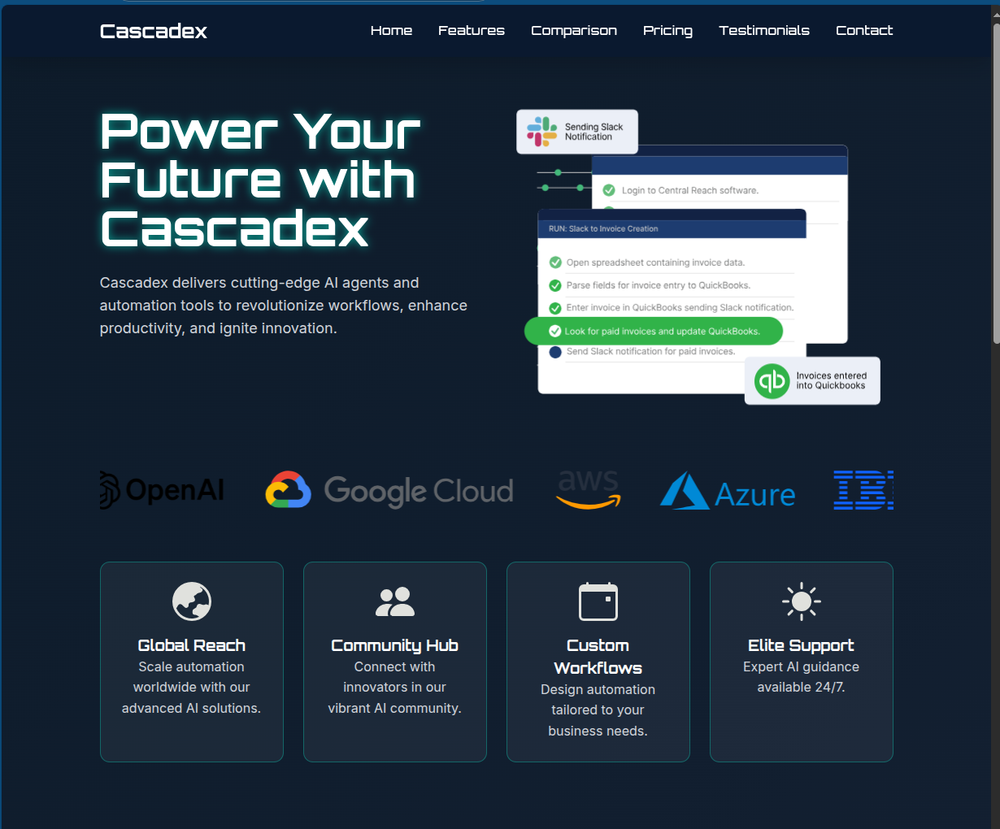

# Cascadex Website README

## Project Overview
The Cascadex website is a modern, responsive single-page application designed to showcase an AI-powered automation tool. The site highlights key features, comparisons with competitors, pricing plans, testimonials, and a contact section, all styled with a futuristic, tech-inspired aesthetic.

## Design Approach
The website was designed with the following principles in mind:

- **User Experience**: A clean, intuitive layout with smooth scrolling and a mobile-friendly navbar toggle ensures accessibility across devices.
- **Visual Aesthetics**: A dark, gradient background with neon accents (#00f5d4, #7b2cbf) and Orbitron/Inter fonts creates a futuristic vibe. Tailwind CSS was used for rapid, consistent styling, supplemented by custom CSS for unique effects.
- **Interactivity**: GSAP animations and ScrollTrigger provide engaging, scroll-based transitions for sections and hero elements, enhancing visual appeal without compromising performance.
- **Modularity**: Content is managed via a `dataStore.js` file, simulating an API, which allows for easy updates and scalability.

## Functionality
The website includes the following key features:

1. **Responsive Navbar**:
   - Toggles a mobile menu with a hamburger icon, using JavaScript to manage visibility and flexbox for layout.
   - Smooth scrolling for anchor links enhances navigation.

2. **Dynamic Content Loading**:
   - The `fetchUtils.js` module simulates API calls to populate sections (hero, features, logos, comparison table, etc.) from `dataStore.js`.
   - Lottie animations and SVG icons are dynamically loaded for visual richness.

3. **Interactive Elements**:
   - A "Read More" button toggles additional feature details.
   - Logo carousel uses CSS animations for a seamless scrolling effect.
   - Comparison table dynamically renders feature comparisons with checkmark/cross/partial indicators.

4. **Animations**:
   - GSAP powers fade-in and slide animations for sections and hero elements, triggered on scroll for a polished experience.
   - Hover effects on cards and buttons add subtle interactivity.

5. **Contact Form**:
   - A styled form with glowing inputs (no backend submission implemented) provides a professional interface for user inquiries.

## Project Screenshot
Below is a screenshot of the Cascadex website, showcasing the hero section with its futuristic design and Lottie animation:

## Reason for Creation
This website was developed as the final project for the "Web Design for Beginners" online learning program conducted by the Department of Information Technology, Faculty of Information Technology, University of Moratuwa, through the Centre for Open & Distance Learning (CODL). The goal was to apply the skills learned in HTML, CSS, and JavaScript to create a fully functional, visually appealing website. I chose to design a site for Cascadex, a fictional AI automation tool, to demonstrate my ability to build a modern, responsive, and interactive web page that aligns with current industry standards and trends.

## Technical Stack
- **HTML/CSS**: Structured with semantic HTML and styled using Tailwind CSS and custom styles in `styles.css`.
- **JavaScript**: Handles interactivity, dynamic content, and animations via vanilla JS and GSAP.
- **External Libraries**:
  - Tailwind CSS for styling.
  - GSAP and ScrollTrigger for animations.
  - DotLottie Player for animations.
- **Fonts**: Orbitron for headings, Inter for body text, sourced from Google Fonts.

## How to Run
1. Clone the repository.
2. Open `index.html` in a browser (no server required, as all assets are CDN-hosted or local).
3. Ensure an internet connection for CDN-hosted libraries (Tailwind, GSAP, DotLottie).

 